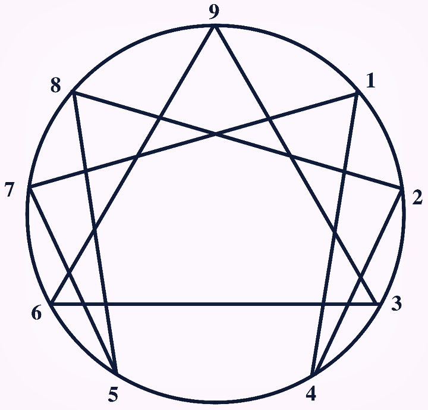

## 20191028 애니어그램 알고리즘

### 문제



```
유형 1   2   3   4   5   6   7   8   9
점수 30  24  21  34  22  21  25  35  40
```

각 유형별로는 점수가 존재하고 가장 높은 점수가 대표 유형이다.
가장 높은 점수의 유형이 중복해서 존재하는 경우 해당 유형의 바로 옆 좌우 유형의 점수 합이 높은 유형이 대표 유형이 된다. 
해당 유형의 바로 옆 좌우 유형의 점수 합이 동일 하면 그다음 칸 좌우 유형의 점수 합을 비교한다. 
만약 우열을 가릴 수 없는 상황이 되면 대표 유형은 중복으로 인정한다.

### 경우의 수

- 유형이 한 개 인 경우

- 중복되었으나 유형이 한 개 인 경우
  - 양옆 이웃한 숫자를 더했을 때 높은 유형이 대표유형이 된다.

- 유형이 여러개인 경우....?
  - 최대 4번 까지 돌린다.
